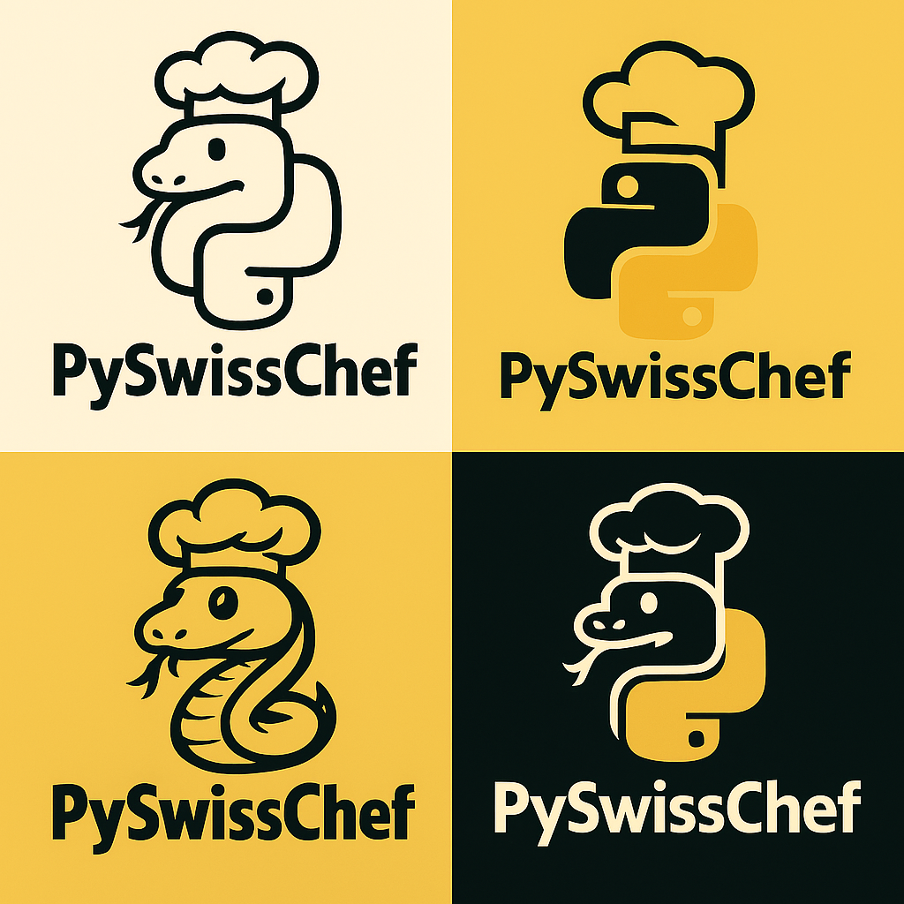

<p align="center">
  
  <br/>PySwissChef by Thabang Mposula
</p>

# 👨‍🍳 Welcome to PySwissChef

**PySwissChef** is a Django-powered automation showcase platform designed to elegantly present and execute my Python scripts. Ive built it with flexibility and style, and it features an administrative portal for managing  my scripts and is also equipped with a guest-friendly interface for public interaction.

---

## 🥘 Features
*   **Gourmet UI**: Premium glassmorphism driven by `lab_theme.css`.
*   **Recipe Catalogue**: Categorized automation scripts with detailed gourmet stories.
*   **Safety First**: One-time security disclaimer and environment-aware execution.
*   **In-Process Engine**: Refactored to run seamlessly in WASM/Browser environments.

---

## 🚀 Launch the Laboratory

Choose your "Cooking Station" based on the recipe's heat requirements:

| Environment | Station Type | Launch Link |
| :--- | :--- | :--- |
| **StackBlitz** | 🍧 Tasting Room (UI Preview) | [](https://stackblitz.com/~/github.com/iarxii/PySwissShef) |
| **Replit** | 🥘 High-Heat Kitchen (Full Run) | [Launch on Replit](https://replit.com/github/iarxii/PySwissShef) |
| **Codespaces** | 🧪 Pro Lab (Dev Environment) | [Launch on GitHub Codespaces](https://github.com/codespaces/new?repo=iarxii/PySwissShef) |

> [!TIP]
> Not sure which one to use? Check the **[Chef's Guide to Lab Stations](docs/LAB_STATIONS.md)** for a full comparison.

## 🏡 Local Kitchen Setup

1.  **Clone & Enter**:
    ```bash
    git clone https://github.com/iarxii/PySwissShef.git
    cd PySwissShef
    ```
2.  **Fire up the Stove**:
    - **Windows**: Run `./start_dev.bat`
    - **Linux/Mac**:
      ```bash
      python3 -m venv venv && source venv/bin/activate
      pip install -r requirements.txt
      python main.py --web
      ```
3.  **Taste the Results**: Access the portal at `http://127.0.0.1:8000`.

---

## 📬 Contact

Created by **Thabang Mposula**  
📧 thabang.mposula@outlook.com

---

## 📄 License

This project is licensed under the MIT License.
```